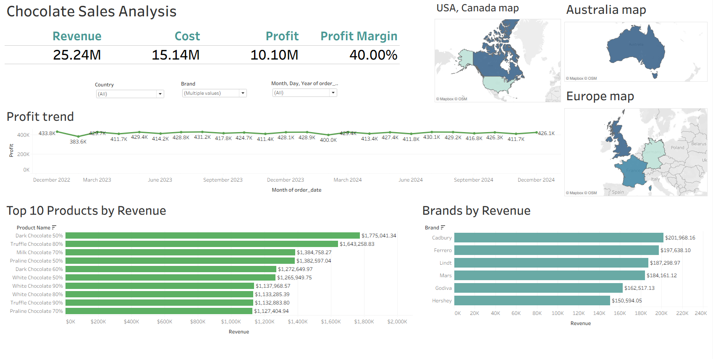

# 🍫 Chocolate Sales Analysis
________________________________________
## Project Overview
This project focuses on analyzing chocolate sales data to identify key business drivers, evaluate profitability, and provide actionable insights.  

The dataset includes transactional data, product information, and store details.  
The goal is to understand sales performance across multiple dimensions such as time, products, stores, and customers.
________________________________________
## Tools and Technologies

### SQL
- Aggregations (`SUM`, `AVG`, `COUNT`)
- `GROUP BY`
- `CASE WHEN`
- Window Functions
- Data validation queries
- JOIN operations

### Data Visualization
- Excel
- Tableau

### Data Analysis Techniques
- Data cleaning and validation
- Exploratory Data Analysis (EDA)
- Data aggregation and transformation
________________________________________
## Dataset Description

The project is based on three main tables:

### sales
- order_id  
- order_date  
- product_id  
- store_id  
- customer_id  
- quantity  
- unit_price  
- discount  
- revenue  
- cost  
- profit  

### products
- product_id  
- product_name  
- brand  
- category  
- cocoa_percent  
- weight_g  

### stores
- store_id  
- store_name  
- city  
- country  
- store_type  

---

## Data Cleaning & Quality Checks

The dataset was validated for data quality issues:

### No issues found:
- No NULL values across all tables
- No duplicate records in sales data
- Revenue and profit calculations validated

Revenue formula:
revenue = quantity * unit_price * (1 - discount)

Profit formula:
profit = revenue - cost

### Data Quality Issues Identified
During the analysis, the following data quality issues were identified:
#### 1. Store ID Inconsistency
The store_id field was not fully consistent between the sales and stores datasets. This may have affected store-level and country-level aggregations, including revenue, profit, and order count metrics. Results based on these dimensions should therefore be interpreted with caution.
#### 2.Product ID Inconsistency
The product_id field was not standardized across the sales and products datasets, resulting in differences in identifier formatting. Due to this inconsistency, product data could not be directly matched using a standard database join. To support the analysis, product information was integrated and validated within Tableau using data relationships and transformation techniques. While this approach enabled product-level analysis, some results may be affected by the underlying data quality limitations.

---

#### 2. Product ID inconsistency (critical issue)
- `product_id` formats differed between `sales` and `products`
- Direct JOIN was not possible
- A normalization approach (string manipulation) was applied to partially align identifiers
- This may introduce limitations in product-level analysis
________________________________________
## Key Performance Indicators (KPIs)

- Total Revenue  
- Total Profit  
- Profit Margin  
- Average Order Value (AOV)  

### Revenue & Profitability
- Overall profitability was calculated using aggregated metrics
- Profit margin formula:
 Profit Margin = Profit / Revenue

 

 Insight: 
The business shows an approximate **40% profit margin**, indicating strong profitability and cost efficiency.

### Average Order Value (AOV)
Calculated using average revenue per order
  
 

Insight: 
AOV provides an overview of customer spending behavior per transaction.

## Product Analysis
Analyzed product performance to identify key revenue and profit drivers across the product portfolio.
Product-level analysis was conducted in Tableau using data relationships and transformation techniques due to inconsistencies in the product_id field between the sales and products datasets. While this approach enabled the analysis, product-level results should be interpreted with caution as some matches may be affected by the underlying data quality issues.

###Top 10 Products by Revenue and Profit

 Insight:
 The product performance analysis revealed that a small group of products contributed the most to overall revenue and profit, with Dark Chocolate 50% emerging as the leading product in both metrics.

## Category Analysis

Product and sales tables could not be reliably joined

 

**Note:**  
- Category-level revenue and profit cannot be accurately calculated
- Aggregated results may contain duplication or mismatches
 

##  Discount Analysis

There is a strong negative relationship between discount level and profitability.

- No discount → highest profit (≈ 10.81)
- Low discount → moderate profit (≈ 9.71)
- Medium discount → lower profit (≈ 8.91)

Conclusion:  
Discounting directly reduces profitability and should be used strategically.

## Country Analysis

- Store ID mismatch between `sales` and `stores` tables
- Country-level revenue and profit may be duplicated or inaccurate

 

### Insight (high-level only)
- Geographic performance trends can still be observed
- However, exact values should be interpreted cautiously

## Executive Summary

This project analyzes chocolate sales performance using SQL to evaluate profitability, revenue drivers, and operational trends.

### Key outcomes:
- Strong overall profitability (~40% margin)
- Clear impact of discounting on profit reduction
- Some reliable high-level insights (KPIs, trends)
- Limited product and category-level analysis due to data quality issues

### Critical finding:
Data integrity issues (especially inconsistent product IDs) significantly limited relational analysis.

## Assumptions & Limitations

- No external data validation was performed
- Product-level insights are partially unreliable
- Store-level joins may introduce inaccuracies
- Analysis is best interpreted at an aggregated level

## Key Takeaways

- The business is profitable and financially stable
- Discounts significantly impact profitability
- Data modeling quality is critical for analytics success
- Aggregated KPIs are more reliable than detailed joins

## Business Recommendations

- Focus on high-performing segments (e.g., dark chocolate)
- Reduce excessive discounting to protect margins
- Improve data governance for product and store IDs
- Implement standardized primary keys across all tables
- Strengthen data validation processes before analysis
